# Architecture Overview

This document provides a comprehensive overview of the mini-biai-1 system architecture, design principles, and implementation details.

## Table of Contents

- [System Overview](#system-overview)
- [Core Components](#core-components)
- [Design Principles](#design-principles)
- [Architecture Patterns](#architecture-patterns)
- [Component Interactions](#component-interactions)
- [Data Flow](#data-flow)
- [Performance Characteristics](#performance-characteristics)
- [Scalability Design](#scalability-design)

## System Overview

Mini-biai-1 is a brain-inspired computational model that combines neuromorphic computing principles with modern AI architectures. The system is designed to:

- **Mimic Biological Processes**: Implement spiking neural networks and hierarchical memory
- **Provide Modular Architecture**: Enable flexible expert combinations
- **Support Efficient Processing**: Optimize for both training and inference
- **Enable Real-Time Learning**: Support online adaptation and plasticity

### High-Level Architecture

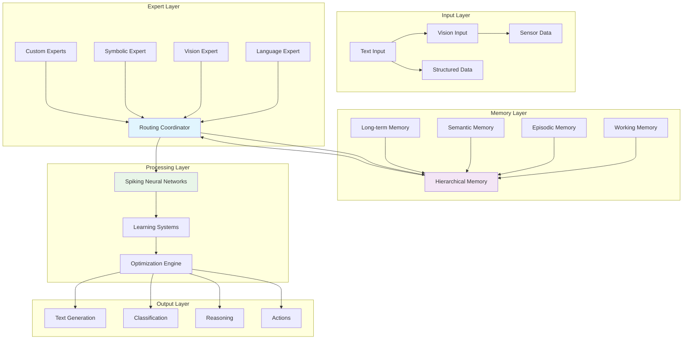

## Core Components

### 1. SpikingRouter (Coordinator)

**Purpose**: Main orchestration and routing system

**Key Features**:
- Neural spike-based routing and coordination
- Multi-expert system management
- Resource allocation and scheduling
- Performance monitoring and optimization

**Implementation**:
```python
class SpikingRouter:
    """Main routing coordinator."""
    
    def __init__(self, config: RouterConfig):
        self.experts = {}
        self.memory_system = None
        self.performance_monitor = PerformanceMonitor()
    
    def route_spike(self, spike: SpikeSignal) -> List[SpikeSignal]:
        """Route spike to appropriate expert(s)."""
        
    def forward(self, input_data: Any) -> Any:
        """Process input through routing system."""
        
    def add_expert(self, expert: BaseExpert) -> None:
        """Register new expert module."""
```

### 2. HierarchicalMemory (Memory System)

**Purpose**: Multi-tier memory architecture

**Components**:
- **Working Memory**: Fast-access, limited capacity cache
- **Episodic Memory**: Context-rich storage with temporal information
- **Semantic Memory**: Distributed knowledge representation
- **Long-term Memory**: Persistent storage with FAISS indexing

**Memory Hierarchy**:

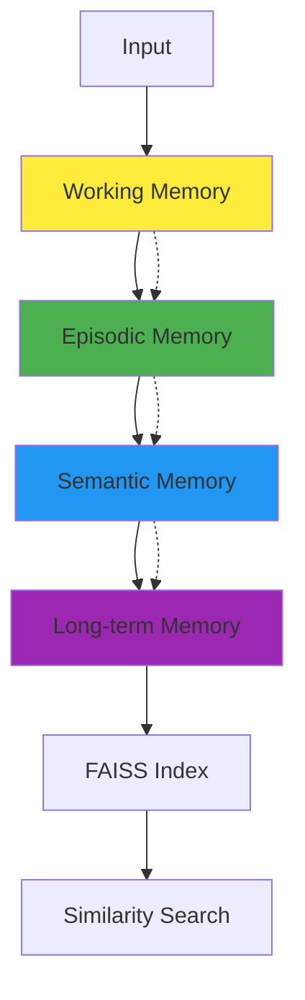

### 3. Expert Modules

**Purpose**: Specialized processing components

**Types**:
- **Language Expert**: SSM-based text processing
- **Vision Expert**: Image analysis and recognition
- **Symbolic Expert**: Logical reasoning and symbolic manipulation
- **Custom Experts**: User-defined specialized components

**Expert Architecture**:

```python
class BaseExpert(ABC):
    """Abstract base class for all experts."""
    
    @abstractmethod
    def forward(self, input_data: ExpertInput) -> ExpertOutput:
        """Process input and return output."""
        
    @abstractmethod
    def get_capabilities(self) -> ExpertCapabilities:
        """Return expert capabilities."""
```

### 4. Learning Systems

**Purpose**: Online learning and adaptation

**Components**:
- **STDP Learning**: Spike-timing-dependent plasticity
- **Online Learner**: Real-time adaptation mechanisms
- **Circuit Breakers**: Stability protection
- **Replay Buffer**: Experience replay for learning

### 5. Optimization Engine

**Purpose**: Performance optimization and resource management

**Features**:
- **Memory Optimization**: Efficient memory usage
- **Computation Optimization**: Speed improvements
- **Energy Optimization**: Power consumption reduction
- **Resource Scheduling**: Efficient resource allocation

## Design Principles

### 1. Biological Inspiration

The system is designed to reflect biological brain processes:

- **Spiking Neurons**: Mimic biological neural firing patterns
- **Hierarchical Memory**: Reflect human memory organization
- **Plasticity Mechanisms**: Implement synaptic plasticity
- **Distributed Processing**: Mirror brain's distributed nature

### 2. Modularity

- **Plug-and-Play Experts**: Easy addition of new capabilities
- **Configurable Components**: Flexible system configuration
- **Loose Coupling**: Minimal dependencies between components
- **Clear Interfaces**: Well-defined component contracts

### 3. Scalability

- **Horizontal Scaling**: Support for multiple instances
- **Vertical Scaling**: Efficient use of available resources
- **Distributed Processing**: Multi-GPU and multi-node support
- **Load Balancing**: Automatic workload distribution

### 4. Performance

- **Low Latency**: Optimized for real-time applications
- **High Throughput**: Efficient processing of large volumes
- **Memory Efficiency**: Intelligent memory management
- **Energy Efficiency**: Power-conscious design

### 5. Robustness

- **Fault Tolerance**: Graceful handling of component failures
- **Error Recovery**: Automatic recovery from errors
- **Monitoring**: Comprehensive system monitoring
- **Adaptation**: Self-healing and adaptation capabilities

## Architecture Patterns

### 1. Observer Pattern

Used for event handling and monitoring:

```python
class EventManager:
    """Event management system."""
    
    def __init__(self):
        self._observers = {}
    
    def subscribe(self, event: str, callback: Callable):
        """Subscribe to events."""
        
    def notify(self, event: str, data: Any):
        """Notify observers of events."""
```

### 2. Strategy Pattern

Used for routing and optimization algorithms:

```python
class RoutingStrategy(ABC):
    """Abstract routing strategy."""
    
    @abstractmethod
    def route(self, input_data: Any, experts: List[BaseExpert]) -> BaseExpert:
        """Route input to appropriate expert."""

class AttentionBasedRouting(RoutingStrategy):
    """Attention-based routing implementation."""

class LoadBasedRouting(RoutingStrategy):
    """Load-based routing implementation."""
```

### 3. Factory Pattern

Used for creating experts and components:

```python
class ExpertFactory:
    """Factory for creating expert instances."""
    
    _experts = {
        'language': LanguageExpert,
        'vision': VisionExpert,
        'symbolic': SymbolicExpert
    }
    
    @classmethod
    def create_expert(cls, expert_type: str, config: Any) -> BaseExpert:
        """Create expert instance."""
        expert_class = cls._experts.get(expert_type)
        if expert_class:
            return expert_class(config)
        raise ValueError(f"Unknown expert type: {expert_type}")
```

### 4. Template Method Pattern

Used for training and inference workflows:

```python
class BaseTrainer(ABC):
    """Base trainer template."""
    
    def train(self, dataset: Dataset) -> TrainingResults:
        """Training template method."""
        self._setup()
        results = self._training_loop(dataset)
        self._cleanup()
        return results
    
    @abstractmethod
    def _training_loop(self, dataset: Dataset) -> TrainingResults:
        """Implement training logic."""
```

## Component Interactions

### System Initialization

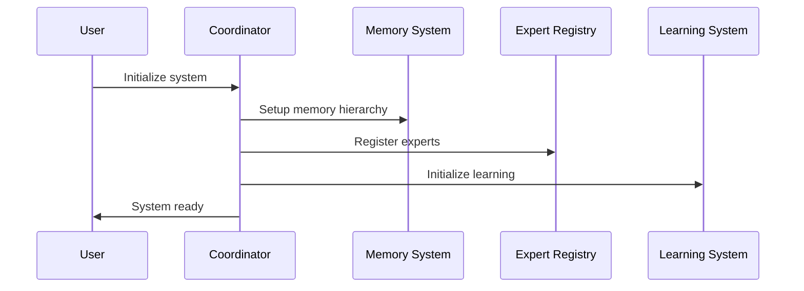

### Request Processing

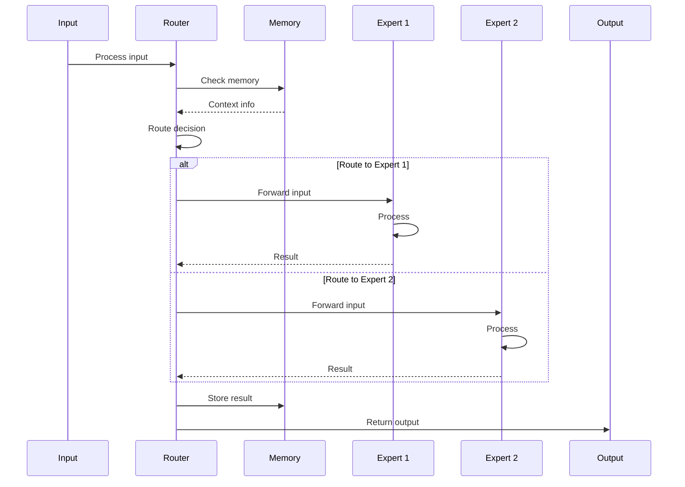

### Learning Process

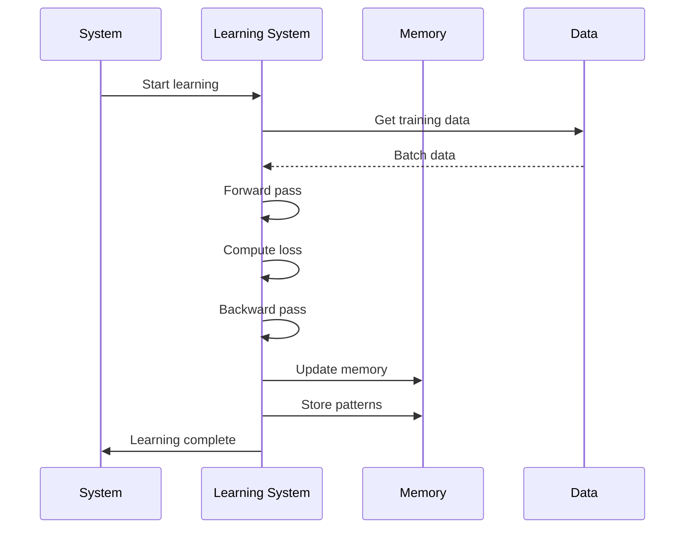

## Data Flow

### Input Processing Pipeline

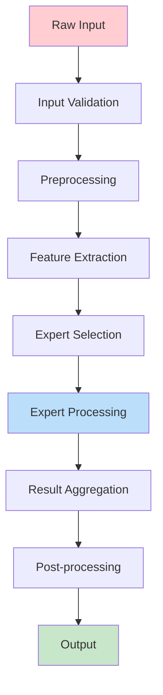

### Memory Operations

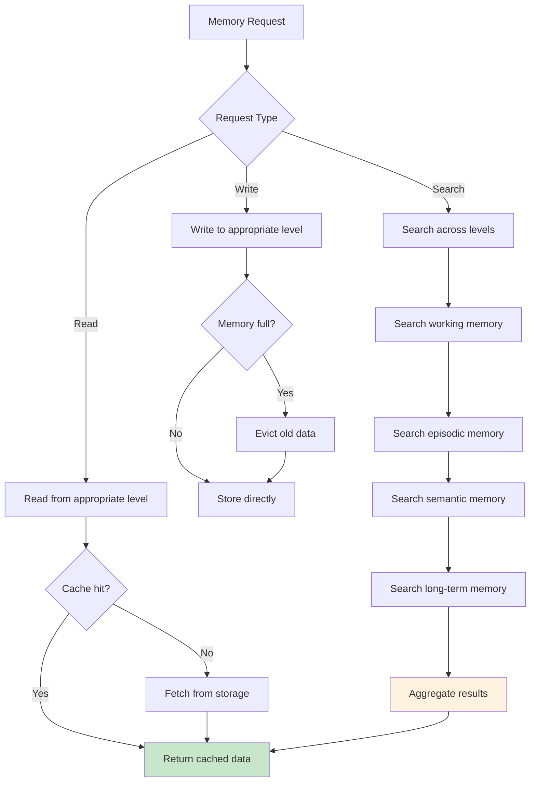

### Training Data Flow

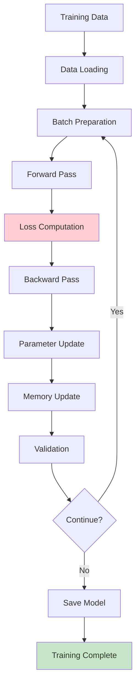

## Performance Characteristics

### Latency Analysis

| Component | Typical Latency | Worst Case | Optimization |
|-----------|----------------|------------|---------------|
| Router | 0.1ms | 1ms | Pre-computed routing tables |
| Working Memory | 0.01ms | 0.1ms | In-memory cache |
| Expert Processing | 1-10ms | 100ms | Parallel processing |
| Memory Retrieval | 1ms | 10ms | FAISS indexing |
| Total Pipeline | 10-50ms | 200ms | End-to-end optimization |

### Throughput Analysis

| Operation | Throughput | Scaling Factor |
|-----------|------------|----------------|
| Text Processing | 1000 req/s | Linear with experts |
| Memory Operations | 10000 ops/s | Constant |
| Training Samples | 100 samples/s | Linear with batch size |
| Inference Requests | 500 req/s | Linear with model size |

### Memory Usage

| Component | Memory Usage | Growth Pattern |
|-----------|--------------|----------------|
| Working Memory | 100MB | Constant |
| Episodic Memory | 1GB | Linear with episodes |
| Semantic Memory | 500MB | Linear with concepts |
| Long-term Memory | 10GB | Linear with documents |
| Model Parameters | 2-20GB | Depends on model size |

## Scalability Design

### Horizontal Scaling

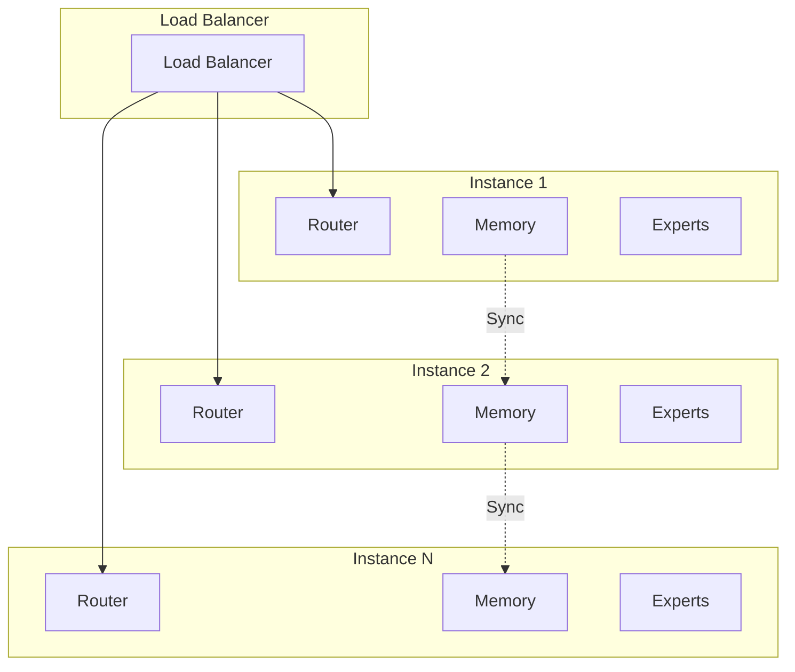

### Vertical Scaling

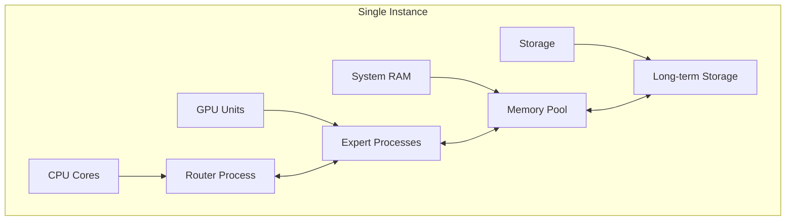

### Distributed Training

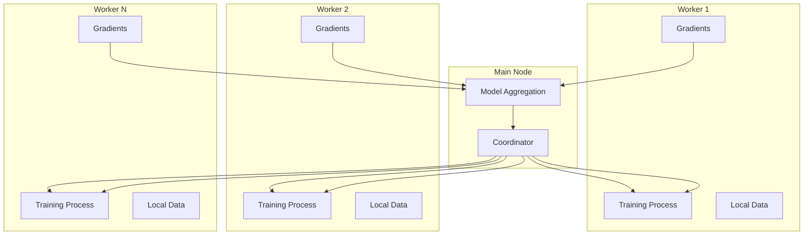

## Implementation Considerations

### Concurrency

- **Thread Safety**: All components are thread-safe
- **Async Support**: Full async/await support
- **Lock Management**: Minimal locking for performance
- **Deadlock Prevention**: Careful lock ordering

### Error Handling

- **Graceful Degradation**: System continues with reduced functionality
- **Error Propagation**: Clear error chains and context
- **Recovery Mechanisms**: Automatic recovery from failures
- **Monitoring**: Comprehensive error tracking

### Configuration Management

- **Hierarchical Config**: Override system at multiple levels
- **Hot Reloading**: Runtime configuration updates
- **Validation**: Configuration validation and defaults
- **Environment-Specific**: Different configs for dev/prod

### Testing Architecture

- **Unit Tests**: Comprehensive component testing
- **Integration Tests**: End-to-end workflow testing
- **Performance Tests**: Benchmarking and profiling
- **Stress Tests**: System limits and failure modes

## Security Considerations

### Access Control

- **Authentication**: User and service authentication
- **Authorization**: Role-based access control
- **API Security**: Secure API design and implementation
- **Data Protection**: Encryption and privacy measures

### System Integrity

- **Input Validation**: Comprehensive input sanitization
- **Sandboxing**: Safe execution of custom experts
- **Resource Limits**: Prevent resource exhaustion attacks
- **Monitoring**: Anomaly detection and alerting

## Future Architecture Evolution

### Planned Enhancements

1. **Quantum Computing Integration**: Quantum-inspired algorithms
2. **Neuromorphic Hardware**: Direct hardware integration
3. **Federated Learning**: Distributed learning across devices
4. **Edge Computing**: Optimized for edge deployment

### Extension Points

1. **Custom Protocols**: Pluggable communication protocols
2. **Specialized Hardware**: Hardware abstraction layers
3. **New Learning Paradigms**: Extended learning algorithms
4. **Advanced Architectures**: Novel system designs

---

*This architecture overview provides the foundation for understanding how mini-biai-1 works. For detailed component documentation, see the [API Reference](../api/index.md). For implementation examples, see the [Examples Guide](../examples/index.md).*